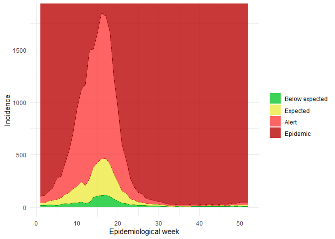

<!-- README.md is generated from README.Rmd. Please edit that file -->

# endemic.channels

<!-- badges: start -->
<!-- badges: end -->

The goal of endemic.channels is to provide functions to compute and plot
endemic channels, using the methodology described in ‘Establishing
endemic levels of ranges with computer spreadsheets’ (Bortman, 1999).

## Installation

You can install the development version of endemic.channels like so:

``` r
library(devtools)
devtools::install_github("denisecammarota/endemic.channels")
```

## Example

Calculating the endemic channels for dummy data, called dengueSP, which
contains the data on dengue cases in the Sao Paulo municipality in
2010-2023:

``` r
library(tidyverse)
#> ── Attaching core tidyverse packages ──────────────────────── tidyverse 2.0.0 ──
#> ✔ dplyr     1.1.4     ✔ readr     2.1.5
#> ✔ forcats   1.0.0     ✔ stringr   1.5.1
#> ✔ ggplot2   3.5.1     ✔ tibble    3.2.1
#> ✔ lubridate 1.9.3     ✔ tidyr     1.3.1
#> ✔ purrr     1.0.2     
#> ── Conflicts ────────────────────────────────────────── tidyverse_conflicts() ──
#> ✖ dplyr::filter() masks stats::filter()
#> ✖ dplyr::lag()    masks stats::lag()
#> ℹ Use the conflicted package (<http://conflicted.r-lib.org/>) to force all conflicts to become errors
library(ggplot2)
library(endemic.channels)
data("dengueSP")
res <- endemic_channel(dengueSP, type = 'geometric', remove_53 = TRUE, show_plot = FALSE)
end_channels <- res[1]
plot <- res[2]
```

The output plot should look something like this:

``` r
print(plot)
#> $plot
```


